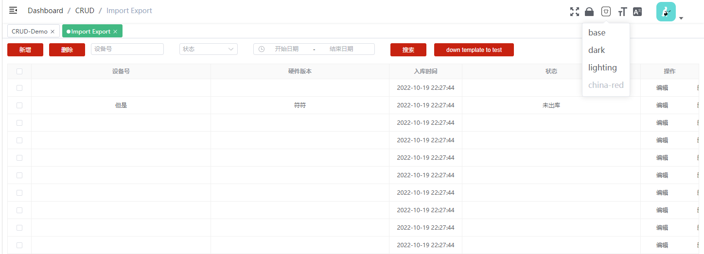
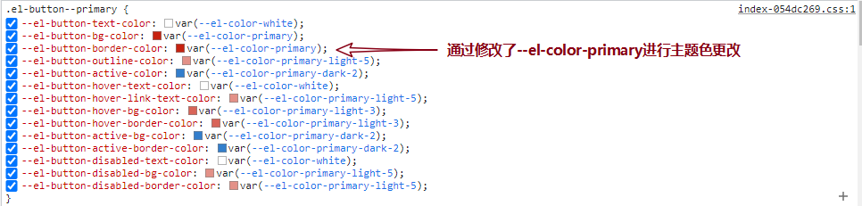
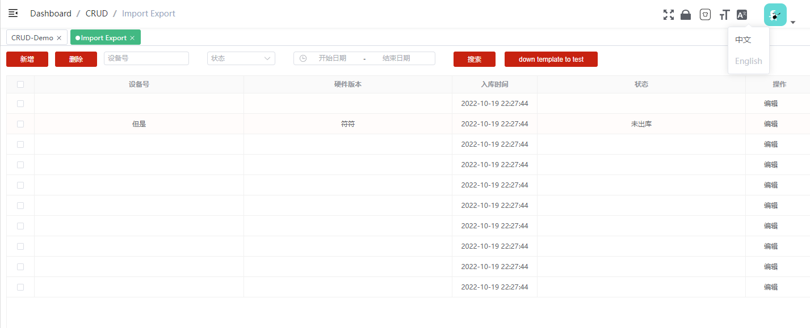
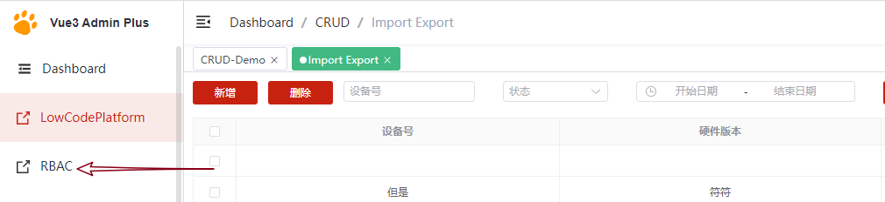
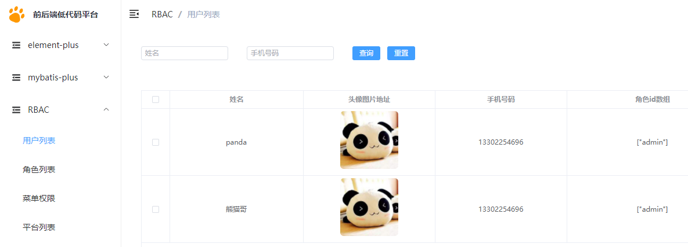
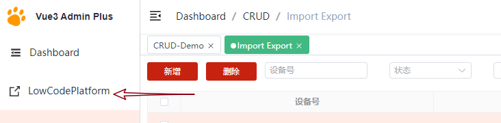

# 前言

感谢大家的支持，目前vue3-admin系列已经超过了1k的点赞，不少公司以此为基础框架，上线了不少的项目

我觉着的这是对这个基础框架的肯定，因此我也表示无比的开心。由于经过了不断的迭代，许多功能和代码已经做

了不小的修改，因此我重新对现有的功能进行重新介绍

## vue3-admin系列框架介绍

[vue3-element-admin](https://github.com/jzfai/vue3-admin-template.git)  ： 框架的js版本，主要面向不会或不太擅长ts的同学，可随时切换成ts开发，也可以ts和js一起开发（推荐作为基础模板进行开发和学习）

[vue3-element-ts](https://github.com/jzfai/vue3-admin-ts.git)：框架的ts版本，主要面向喜欢使用ts的同学，ts设计参考的是，element-plus里的ts配置和目录

[vue3-element-plus](https://github.com/jzfai/vue3-admin-plus.git)：框架的放大版本，框架中集成了各种功能，包括主题色，i18，rbac，低代码平台，错误日志收集，以及常用的demo案例等

[vue3-element-electron](https://github.com/jzfai/vue3-admin-electron.git)： vue3-element-plus的桌面端版本，可直接打包成win，mac应用

> 开发和使用感受：两个字 真香！！！！！

## 重点功能介绍

### 主题色

体验地址：[主题色体验](https://github.jzfai.top/vue3-admin-plus/)

主题色设计参考element-plus源码的主题色切换，原理通过，css3中的变量定义，如--el-button-color, 那么读取时使用 var(--el-button-color)就能进行全局的变量读取。因此本框架中通过修改css3变量的方式就能很方便的进行主题色的设置

## i18多语言

i18语言主要使用 vue-i18 插件进行切换语言，可以实现**无感切换**

## rbac 用户角色权限

[RBAC体验](https://github.jzfai.top/low-code-platform/#/permission-center/user-table-query)

RBAC主要集成了用户，角色，权限，平台的控制，可以对 **菜单** 和 **按钮**进行权限控制

## 低代码平台

[低代码平台体验](https://github.jzfai.top/low-code-platform/#/index)

低代码平台主要于生成前端和后端的代码：

 前端：目前集成了 关于 vue3-admin 系列框架的代码生成，可以快速生成增删改查代码，当然你也可以为自己公司定制特定的模板，以达到最高生成匹配度

后端：目前集成了针对[micro-service-plus](https://github.com/jzfai/micro-service-plus)写的两套模板 ， 主要用于生成基础模板，及多表模板，当然你也可以根据公司进行定制，以达到最大生成匹配度

## 常用的demo案例

多级路由，二级缓存，三级缓存，错误日志收集，vxe-table编辑表格, worker多线程等

